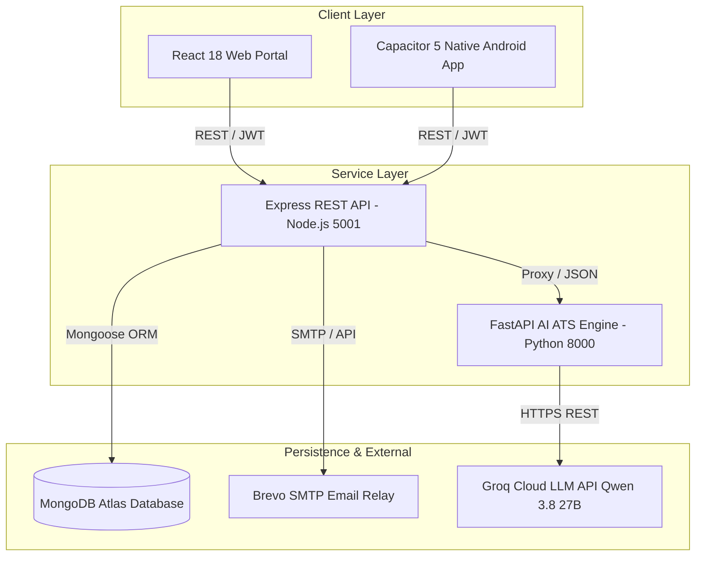
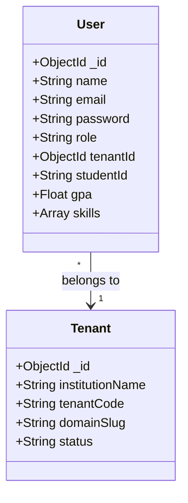
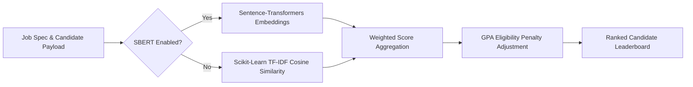
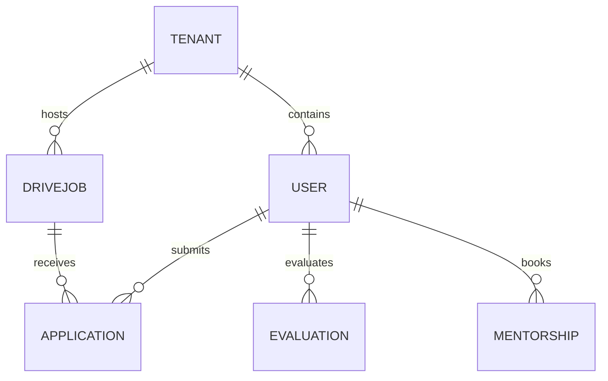

# OfferDesk SaaS — Multi-Tenant University Placement, Mentorship & AI-Driven ATS Ecosystem

> **Comprehensive Technical Documentation & System Reference**  
> *Derived exclusively from the OfferDesk repository implementation.*

---

## 1. System Executive Overview

**OfferDesk** is a multi-tenant Software-as-a-Service (SaaS) platform built for higher education institutions, university placement departments, corporate recruiters, alumni mentors, technical evaluators, and government compliance inspectors (NIRF/NAAC).

The platform unifies campus placement drives, candidate resume parsing via AI-powered Applicant Tracking Systems (ATS), non-placement career tracking (GATE, UPSC, Higher Studies, Entrepreneurship), alumni referral networks, student anxiety/wellness monitoring, and automated NIRF audit reporting.

```
                                +---------------------------------------+
                                |      OfferDesk Client Ecosystem       |
                                | (React 18 Web & Capacitor 5 Mobile)   |
                                +-------------------+-------------------+
                                                    |
                                                    | HTTP / REST (JSON)
                                                    v
                                +-------------------+-------------------+
                                |      Node.js Express REST Backend     |
                                |       (Port 5001 - Mongoose ORM)      |
                                +---------+-----------------+-----------+
                                          |                 |
                   +----------------------+                 +----------------------+
                   |                                                               |
                   v                                                               v
+------------------+------------------+                          +-----------------+-----------------+
|  Python FastAPI AI ATS Engine       |                          |         MongoDB Atlas           |
|  (Port 8000 - SBERT & Groq LLM)     |                          |   (Multi-Tenant Data Storage)    |
+-------------------------------------+                          +-----------------------------------+
```

### Key Highlights Discovered in Codebase
- **Multi-Tenant Architecture**: Complete isolation of university data using domain slugs, unique `tenantCode` identifiers, and strict header-based tenant verification middleware (`x-tenant-id`).
- **8-Tier Role-Based Access Control (RBAC)**: Distinct user roles with custom dashboard workflows (`SYSADMIN`, `TENANT_ADMIN`, `STUDENT`, `RECRUITER`, `DEPT_COORDINATOR`, `MENTOR`, `EVALUATOR`, `AUDITOR`).
- **Dual-Engine AI Candidate Matching**: Uses Scikit-Learn TF-IDF vector cosine matching for low-resource environments and optional Sentence-Transformers (`all-MiniLM-L6-v2`) SBERT semantic embeddings with user-configurable weights (Skills, Projects, GPA, Certifications).
- **Groq LLM Qwen 3.8 27B Microservice**: High-speed AI inference for pre-interview study material generation, chat toxicity moderation, and personalized non-placement recommendations.
- **Cross-Platform Mobile Integration**: Built using React 18 and wrapped with Capacitor 5 for native Android (`.apk`) and iOS builds, including biometric authentication, push notifications, camera, and device state plugins.
- **NIRF & Government Audit Compliance**: Automated NIRF metric calculation (placement percentage, median CTC, higher studies ratio) with immutable audit trail logging.

---

## 2. System Architecture & Component Model

The OfferDesk ecosystem is composed of three decoupled microservices working in concert with external cloud infrastructure:



### Component Boundaries & Communication Protocol
1. **Client Layer (`app/`)**: Built with React 18, React Router DOM v6, Material-UI, TailwindCSS, and Capacitor 5. Communicates with the REST API using Axios over HTTP/HTTPS.
2. **REST API Backend (`services/js-services/`)**: Node.js Express server listening on port `5001`. Handles authentication, JWT signing, multi-tenant scoping, Mongoose schema persistence, audit trail generation, and transactional email triggers via Brevo SMTP.
3. **AI / ML Microservice (`services/ml-services/`)**: Python FastAPI server listening on port `8000`. Receives candidate ranking requests, non-placement advisor queries, and pre-interview study generator jobs. Connects to Groq Cloud API (`https://api.groq.com/openai/v1/chat/completions`) for Qwen LLM inference.
4. **Data Persistence**: Single-cluster multi-tenant MongoDB Atlas database instance containing scoped collections.

---

## 3. Multi-Tenant Architecture & 8-Tier RBAC

OfferDesk uses a shared-database, tenant-isolated data model. Every non-system request contains an `x-tenant-id` HTTP header or user-bound `tenantId` field.



### 8 User Roles & Implemented Workflows

| Role | Target User | Code Directory / Component | Key Implemented Capabilities |
| :--- | :--- | :--- | :--- |
| **`SYSADMIN`** | Platform Super Admin | `app/src/roles/sysadmin/` | Approve/reject tenant institution requests, manage platform global configs, view REST API logs, monitor MongoDB database statistics, inspect audit trails. |
| **`TENANT_ADMIN`** | University Placement Director | `app/src/roles/tenant_admin/` | Manage campus placement drives, verify student offer letters, configure placement eligibility filters, manage student consent waivers, view institution analytics. |
| **`STUDENT`** | Undergraduate / Graduate | `app/src/roles/student/` | View eligible drives, apply for jobs, run AI ATS resume scoring, access prep materials, track non-placement pathways, participate in peer wellness wall, log anxiety index. |
| **`RECRUITER`** | Corporate HR / Employer | `app/src/roles/recruiter/` | Post job drives, set required skill vectors, run AI ATS candidate leaderboard scoring, schedule interview slots, issue digital offer letters. |
| **`DEPT_COORDINATOR`** | Department HOD / Faculty | `app/src/roles/dept_coordinator/` | Manage department rosters, clear placement branch eligibility, audit student technical skills, manage project credits, curate non-placement track blueprints. |
| **`MENTOR`** | Alumni / Industry Senior | `app/src/roles/mentor/` | Host 1-on-1 mentorship sessions, review candidate resumes, issue job referral tokens, answer technical Q&A, post industry experience feeds. |
| **`EVALUATOR`** | Technical / HR Interviewer | `app/src/roles/evaluator/` | Manage departmental question banks, submit structured candidate evaluations (technical, communication, problem solving), view evaluation history. |
| **`AUDITOR`** | Government / NIRF Inspector | `app/src/roles/auditor/` | Verify placement percentage data, audit median salary packages, inspect student higher-education records, validate NIRF & NAAC compliance metrics. |

---

## 4. Microservices Technical Breakdown

### Service 1: Node.js Express REST API (`services/js-services/`)
- **File Entry**: [`services/js-services/server.js`](file:///o:/OfferDesk/services/js-services/server.js)
- **Port**: `5001` (Configurable via `PORT`)
- **Key Modules**:
  - `emailService.js`: Brevo SMTP connection wrapper for sending OTPs, offer letters, security alerts, and password resets.
  - `emailTemplates.js`: HTML template compiler for transactional emails.
  - `models/`: Mongoose model schemas for all 18 database collections.

#### Core Express Middleware Executed
- `cors()`: Cross-Origin Resource Sharing enablement.
- `express.json()`: JSON body payload parsing.
- `authenticate`: Validates `Authorization: Bearer <token>` header using `jsonwebtoken` library.
- `requireTenantId`: Validates tenant context and enforces cross-tenant access denial.

---

### Service 2: Python FastAPI AI Engine (`services/ml-services/`)
- **File Entry**: [`services/ml-services/main.py`](file:///o:/OfferDesk/services/ml-services/main.py)
- **Port**: `8000` (Configurable via `ML_PORT`)
- **Core Dependencies**: `fastapi`, `uvicorn`, `pydantic`, `scikit-learn`, `sentence-transformers` (optional), `urllib3`.
- **Key Files**:
  - `ats_matcher.py`: NLP Cosine similarity matching class (`NLPVectorMatcher`).
  - `groq_service.py`: Groq Cloud Qwen 3.8 27B REST integration (`GroqLLMService`).

#### Dynamic Weight Vector Matcher Algorithm
Candidate scores are computed using user-defined weights or defaults:
$$\text{Total Score} = (S \cdot w_s) + (P \cdot w_p) + (G \cdot w_g) + (C \cdot w_c)$$

Where:
- $S$: Skills similarity match %
- $P$: Project & experience TF-IDF / SBERT match %
- $G$: Normalized academic GPA % (with penalty scaling if below minimum required GPA)
- $C$: Certification vector match %
- $w_s, w_p, w_g, w_c$: Weights (default: $0.40, 0.30, 0.20, 0.10$)



---

### Service 3: React 18 & Capacitor 5 Mobile App (`app/`)
- **File Entry**: [`app/src/index.js`](file:///o:/OfferDesk/app/src/index.js), [`app/src/App.js`](file:///o:/OfferDesk/app/src/App.js)
- **Configuration**: [`app/capacitor.config.json`](file:///o:/OfferDesk/app/capacitor.config.json), [`app/tailwind.config.js`](file:///o:/OfferDesk/app/tailwind.config.js)
- **Native Android Configuration**: [`app/android/app/build.gradle`](file:///o:/OfferDesk/app/android/app/build.gradle)

#### Capacitor Native Plugins Integrated
- `@capacitor/android`: Native Android bridge framework.
- `capacitor-native-biometric`: Native fingerprint/FaceID biometric authentication.
- `@capacitor/camera`: Device camera capture for student profile/offer documents.
- `@capacitor/push-notifications` & `@capacitor/local-notifications`: Campus drive alerts and interview slot reminders.
- `@capacitor/haptics`, `@capacitor/device`, `@capacitor/network`, `@capacitor/preferences`, `@capacitor/splash-screen`, `@capacitor/status-bar`.

---

## 5. MongoDB Database Schemas & Data Models

All data models reside in [`services/js-services/models/`](file:///o:/OfferDesk/services/js-services/models/).



### Complete Schema Summary

1. **`User.js`**: Stores user credentials, role (`SYSADMIN`, `TENANT_ADMIN`, `STUDENT`, `RECRUITER`, `DEPT_COORDINATOR`, `MENTOR`, `EVALUATOR`, `AUDITOR`), `tenantId`, `gpa`, `skills`, `bio`, `project_summary`, `certifications`, `department`, `graduationYear`, `isVerified`.
2. **`Tenant.js`**: University tenant profile storing `institutionName`, `tenantCode`, `domainSlug`, `adminEmail`, `status` (`PENDING`, `APPROVED`, `REJECTED`), `accreditationStatus`, `studentCapacity`.
3. **`DriveJob.js`**: Placement drive postings storing `tenantId`, `recruiterId`, `company`, `jobTitle`, `description`, `requiredSkills`, `minGpa`, `ctcPackage`, `location`, `deadline`, `eligibilityCriteria`.
4. **`Application.js`**: Student applications storing `jobId`, `studentId`, `tenantId`, `status` (`APPLIED`, `SHORTLISTED`, `INTERVIEW_SCHEDULED`, `OFFERED`, `REJECTED`), `atsScore`, `appliedAt`.
5. **`Evaluation.js`**: Candidate interview scores submitted by evaluators storing `applicationId`, `evaluatorId`, `technicalScore`, `communicationScore`, `problemSolvingScore`, `comments`, `decision`.
6. **`StudentConsent.js`**: Legal & placement policy waivers storing `studentId`, `tenantId`, `policyVersion`, `isConsented`, `digitalSignature`, `consentedAt`.
7. **`OfferAcceptance.js`**: Official offer letter acceptances storing `applicationId`, `studentId`, `tenantId`, `companyName`, `ctcOffered`, `verificationStatus`, `offerLetterUrl`.
8. **`NonPlacementPathway.js`**: HOD-curated tracks storing `tenantId`, `domain` (`HIGHER_STUDIES_GATE`, `GOVT_EXAMS_UPSC`, `OFF_CAMPUS_JOBS`, `ENTREPRENEURSHIP`), `title`, `visionNote`, `actionBlueprint`, `resources`, `roles`.
9. **`Mentorship.js`**: Alumni mentoring sessions storing `mentorId`, `studentId`, `tenantId`, `sessionDate`, `topic`, `status`, `meetingLink`.
10. **`PeerPost.js`**: Student wellness community wall storing `studentId`, `tenantId`, `content`, `likesCount`, `isAnonymous`, `createdAt`.
11. **`StressEntry.js`**: Placement anxiety logs storing `studentId`, `tenantId`, `stressLevel` (1-10), `triggerFactors`, `loggedAt`.
12. **`Notice.js`**: Campus announcements storing `tenantId`, `title`, `content`, `targetRole`, `authorId`, `createdAt`.
13. **`Notification.js`**: In-app notifications storing `userId`, `tenantId`, `title`, `message`, `isRead`, `createdAt`.
14. **`ChatMessage.js`**: Real-time channel messages storing `channelId`, `senderId`, `tenantId`, `message`, `isFlagged`, `createdAt`.
15. **`DriveSpace.js`**: Dedicated drive chat room profiles storing `jobId`, `tenantId`, `title`, `activeParticipants`.
16. **`DrivePrepMaterial.js`**: AI-generated interview prep cached per drive storing `jobId`, `technicalTopics`, `sampleQuestions`, `systemDesignPrep`, `aptitudeFocus`.
17. **`QuestionBank.js`**: Departmental evaluation questions storing `tenantId`, `category`, `questionText`, `difficulty`, `suggestedAnswer`.
18. **`AuditLog.js`**: System audit records storing `user_id`, `role`, `action`, `details`, `clientIp`, `tenantId`, `timestamp`.

---

## 6. Complete API Route Registry

### Health & Diagnostics
- `GET /api/health` — REST Backend health check and database connection status.
- `GET /health` — Python ML FastAPI engine health check and SBERT/Groq status.

### Authentication & Tenant Management
- `POST /api/auth/register` — User registration bound to `tenantId` and `role`.
- `POST /api/auth/login` — User authentication returning JWT token & user profile.
- `GET /api/auth/me` — Current authenticated user profile retrieval.
- `POST /api/sysadmin/tenants/request` — Public university tenant onboarding request.
- `POST /api/sysadmin/tenants/approve` — SysAdmin tenant approval & activation.
- `GET /api/sysadmin/tenants` — Fetch all system tenants.

### Placement Drives & Applications
- `POST /api/drives` — Create new job drive posting (Recruiter / Tenant Admin).
- `GET /api/drives` — Fetch eligible placement drives for current tenant.
- `POST /api/applications/apply` — Submit student job application.
- `GET /api/applications` — List applications filtered by drive or candidate.

### AI ATS & Groq Microservice Endpoints
- `POST /api/ats/rank` (Express Proxy) / `POST /api/ats/rank-candidates` (FastAPI): Scores candidate list against job specifications using NLP cosine similarity.
- `POST /api/ai/prep-materials`: Invokes Groq Qwen 3.8 27B LLM to generate 4-section structured interview preparation materials.
- `POST /api/ai/moderate-chat`: Invokes AI toxicity filter on student chat messages.
- `POST /api/ai/non-placement-recommendations`: Generates tailored guidance for non-placement tracks.

### Mentorship & Referrals
- `POST /api/mentorship/sessions` — Book mentor 1-on-1 session.
- `GET /api/mentorship/mentors` — Fetch registered alumni mentors.
- `POST /api/mentorship/referrals` — Issue candidate job referral token.

### Auditor & NIRF Compliance
- `GET /api/auditor/overview` — Institution high-level audit summary.
- `GET /api/auditor/nirf-metrics` — Calculated NIRF placement percentage & median CTC metrics.
- `GET /api/auditor/placements` — Verified offer letter audit records.

---

## 7. AI / ML Engine & Vector Processing

### Cosine Vector Matching Implementation
The `NLPVectorMatcher` class ([`services/ml-services/ats_matcher.py`](file:///o:/OfferDesk/services/ml-services/ats_matcher.py)) handles text tokenization, TF-IDF matrix vectorization, and cosine similarity calculation:

$$\text{Cosine Similarity} = \frac{\vec{V}_1 \cdot \vec{V}_2}{\|\vec{V}_1\| \|\vec{V}_2\|} = \frac{\sum_{i=1}^{n} v_{1i} v_{2i}}{\sqrt{\sum_{i=1}^{n} v_{1i}^2} \sqrt{\sum_{i=1}^{n} v_{2i}^2}}$$

- **Sentence-Transformers (SBERT)**: When `ENABLE_SBERT=true` is specified, the microservice loads `all-MiniLM-L6-v2` to calculate dense vector embeddings.
- **Scikit-Learn TF-IDF Fallback**: In low-memory environments (e.g. Render Free Tier <512MB RAM), the system automatically uses n-gram (1,2) TF-IDF vectorization.

---

## 8. Development & Deployment Operations

### Environment Configuration Setup

#### Root Credentials ([`atlas-credentials.env`](file:///o:/OfferDesk/atlas-credentials.env))
```env
MONGODB_USERNAME="godfreytrprof_db_user"
MONGODB_PASSWORD="<password>"
MONGODB_URI="mongodb+srv://godfreytrprof_db_user:<password>@hellotheoriongd.rbxbuxe.mongodb.net"
COLLECTION NAME/DATABASE NAME="OfferDesk"
```

#### Express API Backend ([`services/js-services/.env`](file:///o:/OfferDesk/services/js-services/.env))
```env
PORT=5001
NODE_ENV=development
MONGODB_URI=mongodb+srv://godfreytrprof_db_user:<password>@hellotheoriongd.rbxbuxe.mongodb.net/OfferDesk?retryWrites=true&w=majority
JWT_SECRET=04d5b1fef6dc3a94cec82b6c45fab379d5b53a54de7c0dc964d3cb4fb2379547
JWT_EXPIRES_IN=7d
SMTP_HOST=smtp-relay.brevo.com
SMTP_PORT=587
SMTP_USER=b463ca001@smtp-brevo.com
SMTP_PASS=<brevo_pass>
BREVO_API_KEY=<brevo_key>
SMTP_FROM_EMAIL=godfrey.cs23@krct.ac.in
SMTP_FROM_NAME=OfferDesk Security
AI_SERVICE_URL=https://offerdesk-ml-backend.onrender.com
```

#### Python ML Engine ([`services/ml-services/.env`](file:///o:/OfferDesk/services/ml-services/.env))
```env
ML_HOST=0.0.0.0
ML_PORT=8000
SBERT_MODEL_NAME=all-MiniLM-L6-v2
GROQ_API_KEY=<groq_key>
GROQ_MODEL=qwen/qwen3.8-27b
```

#### React / Capacitor App ([`app/.env`](file:///o:/OfferDesk/app/.env))
```env
REACT_APP_API_URL=https://offerdesk-js-backend.onrender.com
REACT_APP_AI_SERVICE_URL=https://offerdesk-ml-backend.onrender.com
CAPACITOR_APP_ID=com.offerdesk.app
CAPACITOR_APP_NAME=OfferDesk
GENERATE_SOURCEMAP=false
```

---

### Operating via Master System Orchestrator (`run_system.ps1`)

The repository includes a PowerShell master orchestrator ([`run_system.ps1`](file:///o:/OfferDesk/run_system.ps1)):

```powershell
# 1. Run environment pre-flight health checks
.\run_system.ps1 -CheckOnly

# 2. Launch all 3 services in dedicated color-coded terminal windows
.\run_system.ps1 -Mode Windowed

# 3. Launch all services as PowerShell background jobs
.\run_system.ps1 -Mode Background

# 4. Gracefully terminate all active OfferDesk processes on ports 5001, 8000, 3000
.\run_system.ps1 -Stop
```

---

### Mobile App Build & Android APK Release Workflow

```powershell
# 1. Navigate to app directory
cd app

# 2. Compile optimized production React web bundle
npm run build

# 3. Sync web assets & native plugins to Capacitor Android project
npm run cap:sync

# 4. Generate 2048-bit RSA Keystore (stored in app/android/app/offerdesk-release-key.jks)
keytool -genkeypair -v -keystore android/app/offerdesk-release-key.jks -alias offerdesk-key -keyalg RSA -keysize 2048 -validity 10000

# 5. Compile Signed Production Release APK using Gradle Wrapper
cd android
.\gradlew assembleRelease
```

- **Generated APK Output**: `app/android/app/build/outputs/apk/release/app-release.apk`

---

## 9. Automated Test Suite

The repository contains an automated Node.js test suite in [`scripts/`](file:///o:/OfferDesk/scripts/):

```powershell
# Run full automated role verification suite
cd scripts
node run_all_role_tests.js
```

### Individual Test Suite Modules
- `test_full_tenant_lifecycle.js`: Complete end-to-end simulation of tenant request, approval, recruiter drive creation, student application, AI ATS scoring, interview evaluation, offer issuance, and offer verification.
- `test_sysadmin.js`: SysAdmin API & tenant approval checks.
- `test_tenant_admin.js`: Placement drive filtering & consent management checks.
- `test_student.js` & `test_student_consents.js`: Student job application & policy waiver checks.
- `test_recruiter.js`: Recruiter drive creation & offer generation checks.
- `test_dept_coordinator.js`: Department roster & skill audit checks.
- `test_mentor.js`: Mentorship session booking & referral token checks.
- `test_evaluator.js`: Question bank & candidate evaluation submission checks.
- `test_auditor.js`: NIRF metric calculation & placement verification audit checks.

---

## 10. Render Infrastructure Deployment Blueprint

The repository contains a production Blueprint Spec ([`render.yaml`](file:///o:/OfferDesk/render.yaml)) configured for Render auto-deployment:

| Service Name | Type | Runtime | Root Dir | Build Command | Start Command |
| :--- | :--- | :--- | :--- | :--- | :--- |
| `offerdesk-frontend` | Web (Static) | Node | `app` | `npm install && npm run build` | Static Publish (`build`) |
| `offerdesk-js-backend` | Web Service | Node | `services/js-services` | `npm install` | `npm start` |
| `offerdesk-ml-backend` | Web Service | Python | `services/ml-services` | `pip install -r requirements.txt` | `uvicorn main:app --host 0.0.0.0 --port $PORT` |

---

## 11. Security & Data Protection Mechanisms

- **Password Hashing**: User passwords are encrypted using `bcryptjs` with salt rounds before database persistence.
- **JWT Authentication**: REST API routes are guarded with signed JSON Web Tokens (`JWT_SECRET`) expiring in 7 days.
- **Tenant Isolation**: Queries enforce `tenantId` match, preventing cross-institution data leaks.
- **Input & Chat Moderation**: AI toxicity keyword filtering and Groq LLM moderation detect abusive/discriminatory text in community channels.
- **Audit Trail Persistence**: Every critical administrative action is logged to the `AuditLog` collection with IP address, user role, action, and timestamp.
- **APK Signing**: Native Android release builds enforce SHA256withRSA signature verification using a dedicated `.jks` KeyStore.

---

## 12. Repository Directory Map

```
OfferDesk/
├── .github/                      # GitHub Workflows & CI/CD pipeline
├── app/                          # React 18 & Capacitor 5 Web/Mobile Client
│   ├── android/                  # Native Android Gradle Project & KeyStore
│   ├── public/                   # Static HTML templates & icons
│   ├── src/
│   │   ├── components/           # Shared UI Components (LandingPage, NoticeBoard, etc.)
│   │   ├── context/              # Auth & Tenant React Context Providers
│   │   ├── roles/                # 8 Distinct Role Dashboards & Screen Components
│   │   │   ├── auditor/
│   │   │   ├── dept_coordinator/
│   │   │   ├── evaluator/
│   │   │   ├── mentor/
│   │   │   ├── recruiter/
│   │   │   ├── student/
│   │   │   ├── sysadmin/
│   │   │   └── tenant_admin/
│   │   └── services/             # Axios API Client & ATS AI Wrappers
│   ├── capacitor.config.json     # Capacitor Mobile Native Configuration
│   ├── package.json              # Frontend Node Dependencies
│   └── tailwind.config.js        # Tailwind CSS Design System Configuration
├── services/                     # Backend Microservices Directory
│   ├── js-services/              # Node.js Express REST API Backend
│   │   ├── models/               # 18 Mongoose Database Model Schemas
│   │   ├── emailService.js       # Brevo SMTP Email Handler
│   │   ├── emailTemplates.js      # Transactional Email HTML Generators
│   │   └── server.js             # Express API Application Server
│   └── ml-services/              # Python FastAPI AI & Vector Matching Microservice
│       ├── ats_matcher.py        # TF-IDF & SBERT NLP Cosine Vector Matcher
│       ├── groq_service.py       # Groq Qwen 3.8 27B LLM Service Class
│       ├── main.py               # FastAPI Application Router & Models
│       └── requirements.txt      # Python Dependencies
├── scripts/                      # Automated Integration & Role Test Suite
├── atlas-credentials.env         # MongoDB Atlas Connection Credentials
├── render.yaml                   # Render Cloud Infrastructure Blueprint
├── run_system.ps1                # PowerShell Master System Launch Orchestrator
└── README.md                     # System Documentation (This File)
```

---
*Documentation generated based on codebase analysis of OfferDesk.*
